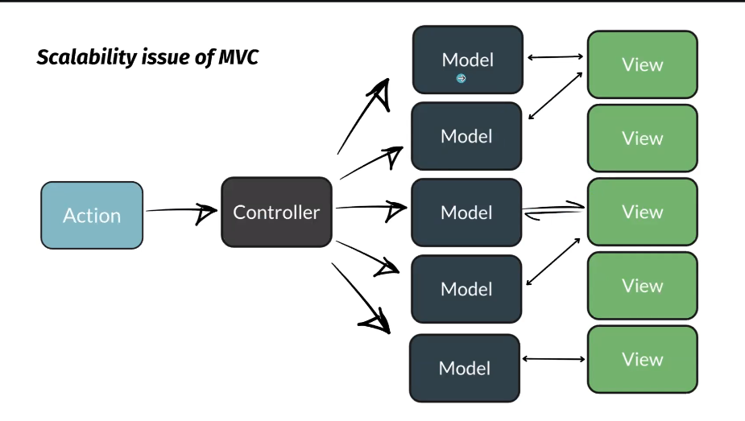
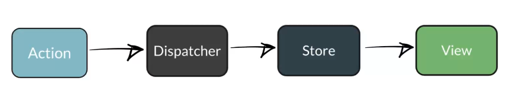
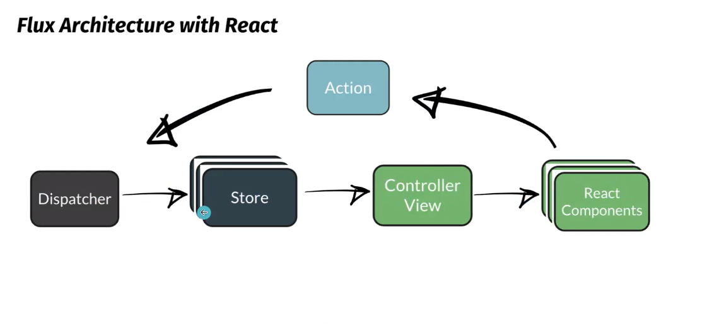
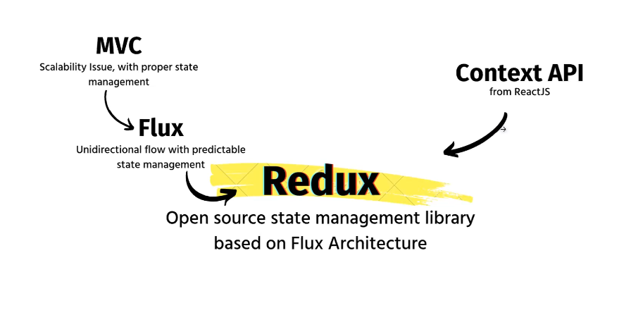
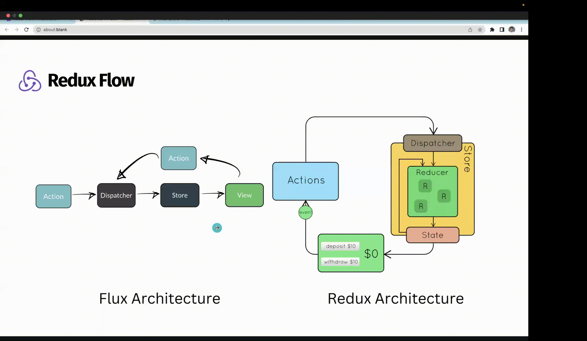

# Redux

### MVC Architecture

- Action &rarr; Controller &rarr; model &harr;  view

    - Here model and  view are having a bi-directional communication.
    - view can directly change model as well as  it can trigger controller that will lead to update model and hence results in view updation.

- The issue comes with this arch is as we scale our app on bigger level then it creates issues as we are having multiple models as well as views so it's difficult to keep a track of which view has trigger which model or controller and hence results in state updation.

-   Arch Image : 

    

-   To resolve this issue we came up with a new Arch ***{Flux}***.

    

-   It has a uni-directional flow , with predictable state management.

    

## Redux : 

-   Redux is a predictable and global/central state/container management library for JS Application.

-   It follows the flux Arch.

-   debugging becomes easy here due to uni-directional flow.

-   Increases Performance optimization.

-   Scaling complexity becomes easier.

-   Clean code.

    

### Three Principle of Redux : 

-   ### Single Source of Truth :

    - we have only one store object to handle global data.

    - we can store all data in key-value pair form in global store object.

-   ### State is Read Only : 

    -   we have to use hooks provided by react so we can perform all 3 operation : accessing , storing and updating data.

    - ***useDispatcher*** : It's used to change state value.

    - ***useSelector*** : It's used to select one of required global state from store.

-   ### Changes are made with pure functions : 
    - Fuction output should be predictable and has no side effects.

- ## Redux work Flow : 

        

